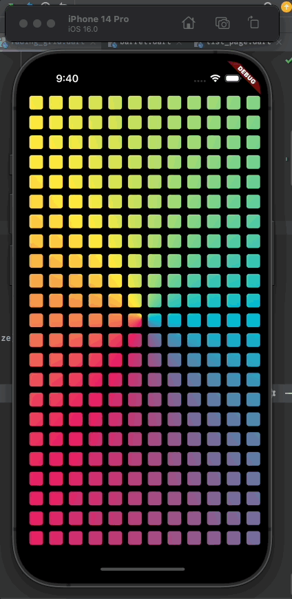
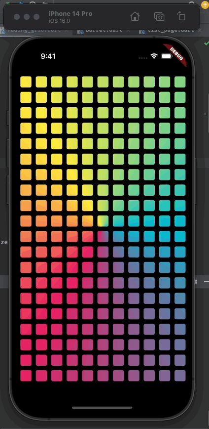

# Animations Playground 

This repo contains some animations that i implemented in my free time. You can see the animations on my [Twitter Page](https://twitter.com/iamjideguru) 
Feel free to star, fork and contribute.

## Animation Demos

#### Fading Grid || [Link to code](https://github.com/JideGuru/animation_playground/blob/master/lib/animations/grid_magnification/fading_grid.dart)

#### Grid Magnification || [Link to code](https://github.com/JideGuru/animation_playground/blob/master/lib/animations/grid_magnification/grid_magnification.dart)

## Getting Started

This project is a starting point for a Flutter application.

A few resources to get you started if this is your first Flutter project:

- [Lab: Write your first Flutter app](https://docs.flutter.dev/get-started/codelab)
- [Cookbook: Useful Flutter samples](https://docs.flutter.dev/cookbook)

For help getting started with Flutter development, view the
[online documentation](https://docs.flutter.dev/), which offers tutorials,
samples, guidance on mobile development, and a full API reference.
